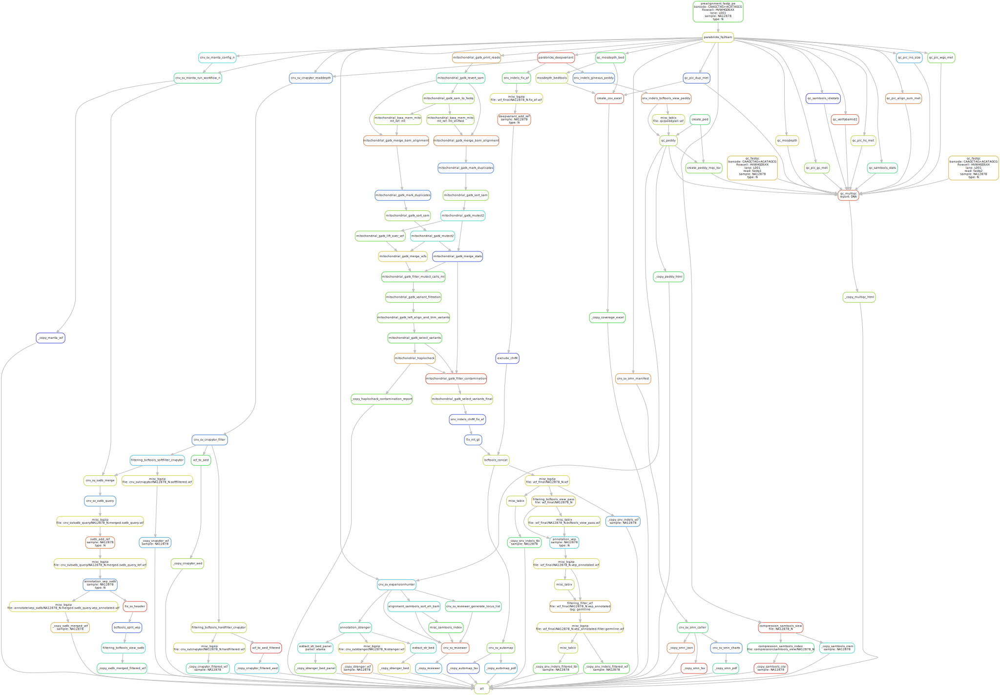

# Poirot RD WGS
 Clinical Genomics Uppsala rare disease pipeline for Illumina whole genome sequence data.


<p align="center">
<a href="https://poirot-rd-wgs.readthedocs.io/en/latest/">https://poirot-rd-wgs.readthedocs.io/en/latest/</a>
</p>

This ReadMe is only a brief introduction, please refer to ReadTheDocs for the latest documentation and a more detailed description of the pipeline. 

---


[](https://poirot-rd-wgs.readthedocs.io/en/latest/?badge=latest)

[](https://opensource.org/licenses/gpl-3.0.html)

## :speech_balloon: Introduction
This pipeline is created to run on Illumina whole genome sequence data to call germline variants.

## :white_check_mark: Testing

The workflow repository contains a dry run test of the pipeline in  `.tests/integration` which can be run like so:

```bash
$ cd .tests/integration
$ snakemake -n -s ../../workflow/Snakefile --configfile config/config.yaml 
```

## :rocket: [Usage](https://poirot-rd-wgs.readthedocs.io/en/latest/running/)

To use this run this pipeline the requirements in `requirements.txt` must be installed. It is most straightforward to install the requirements inside a python virtual environment created with the python [venv module](https://docs.python.org/3/library/venv.html). The `sample.tsv`, `units.tsv`, `resources.yaml`, and `config.yaml` files need to be available in the current directory (or otherwise specified in `config.yaml`). You always need to specify the `config`-file either in the profile yaml file or in the snakemake command. To run the pipeline:

```bash
$ snakemake --profile /path/to/snakemakeprofile --configfile config.yaml -s /path/to/poirot_rd_wgs/workflow/Snakefile
```
## :judge: Rule Graph

